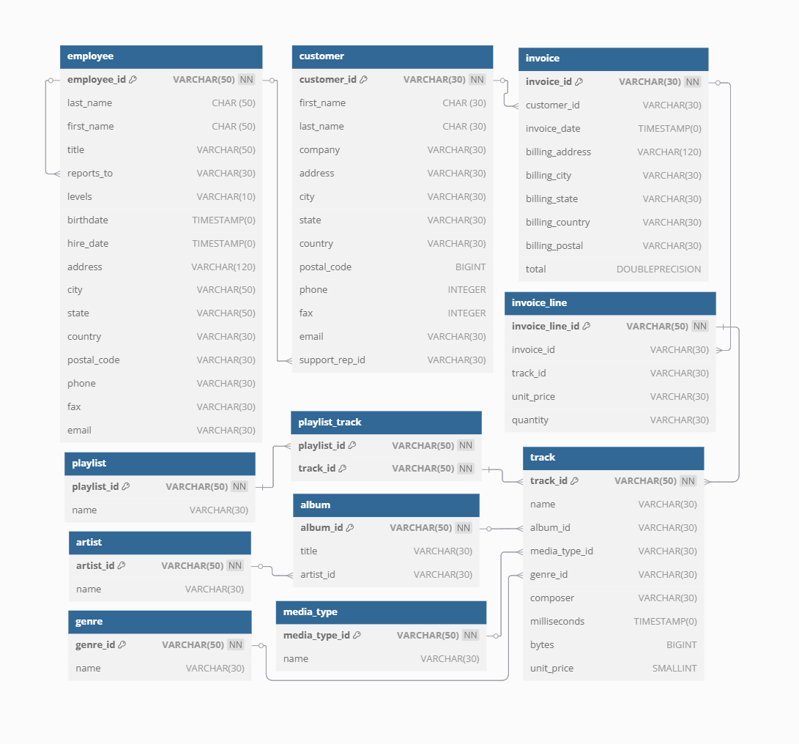

# Music Store Analysis (PostgreSQL Project)

This project analyzes a sample music store database using **PostgreSQL** to extract meaningful business insights. It focuses on sales performance, customer behavior, and inventory analytics by writing and executing SQL queries.

## 📁 Project Structure

- `Music_Store_Analysis.sql` – Contains all SQL queries used in this project.
- `database_diagram.png` – ERD or schema of the database used for better understanding.

## 🛠️ Tools & Technologies

- **Database:** PostgreSQL
- **Client:** pgAdmin 4
- **Language:** SQL

## 📊 Analysis Objectives

- Identify top-selling tracks and albums
- Determine the best performing artists and genres
- Analyze customer purchasing behavior by country
- Assess employee performance (sales agents)
- Explore invoice and revenue trends

## 🧠 Key Insights (Examples)

- The most popular genre is **Rock**, accounting for 30% of total sales.
- **USA** leads in purchases with over 40% contribution.
- Top-selling artist: **AC/DC**
- The best-performing sales agent is **Jane Peacock**.

## 🗂️ Sample Queries

```sql
-- Top 5 selling genres
SELECT genre.name, COUNT(*) AS total_sales
FROM invoice_line
JOIN track ON invoice_line.track_id = track.track_id
JOIN genre ON track.genre_id = genre.genre_id
GROUP BY genre.name
ORDER BY total_sales DESC
LIMIT 5;
```

## 🚀 How to Use

1. Clone the repository:
   ```bash
   git clone https://github.com/jahidhsanto/Music_Store_Analysis.git
   ```
2. Open **pgAdmin** or any other PostgreSQL client.
3. Load the database using the `Database.sql` file provided.
4. Open and run queries from `Music_Store_Analysis.sql` to extract insights.

## 🖼️ Database Schema

<p align="center">
  
</p>

## 🙋‍♂️ About Me

**Md. Jahid Hassan**  
Data Analyst | Data Enthusiast  
📧 jahidhsanto@gmail.com  
🔗 [LinkedIn](https://linkedin.com/in/jahidhsanto) | [GitHub](https://github.com/jahidhsanto)

## 📜 License

This project is open-source and available under the [MIT License](LICENSE).
